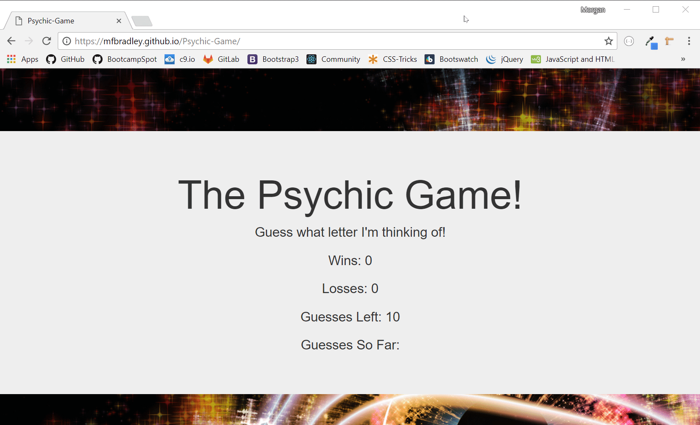

# Psychic-Game

The psychic game combines **HTML**, **CSS**, **Javascript**, and **Bootstrap** to create a fun web-app where the computer picks a random letter and the user trys to guess that letter.

When the page loads, the computer will choose a random letter that is hidden from the user. The user gets 10 tries to guess the correct letter. The app registers user key strokes with **onkeyup events** to determine if the user's letter matches the computer's. The app then lists out the guesses so far at the bottom of the screen.

Using a **conditional statement**, the app determines whether or not the user wins or loses and updates the innerHTML accordingly. Pyschic Game in action below. Game resets completely when page reloads.

